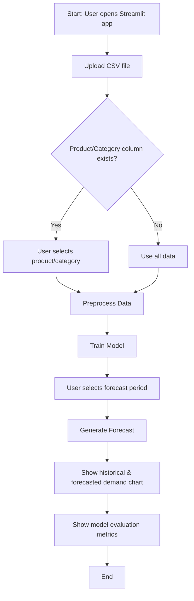

# E-Commerce Demand Forecasting System

This project is designed to forecast demand for e-commerce products using historical sales data. It includes data preprocessing, model training, and evaluation components to ensure accurate predictions.

## Project Structure

```
ecommerce-demand-forecasting
├── data
│   ├── #Upload data for prediction
├── src
│   ├── data_preprocessing.py      # Data loading and preprocessing functions
│   ├── forecasting_model.py       # Model training and forecasting functions
│   ├── evaluation.py              # Model evaluation metrics
├── app.py                         # Streamlit UI application
├── requirements.txt               # Python dependencies
├── README.md                      # Project overview and setup
├── DOCUMENTATION.md               # (This file) Detailed codebase documentation
```

## Setup Instructions

1. Clone the repository:
   ```
   git clone https://github.com/raza-abidii/E-Commerce-Demand-Forecasting-System
   ```

2. Install the required dependencies:
   ```
   pip install -r requirements.txt
   ```

3. Prepare your data:
   - Place your raw data files in the `data` directory.
   - Run the data preprocessing script to clean and transform the data.

## Usage Examples

- To preprocess the data, run:
  ```
  python src/data_preprocessing.py
  ```

- To train the forecasting model, execute:
  ```
  python src/forecasting_model.py
  ```

- To evaluate the model's performance, use:
  ```
  python src/evaluation.py
  ```

## 📊 Application Flow



## Contributing

Contributions are welcome! Please open an issue or submit a pull request for any improvements or bug fixes.
